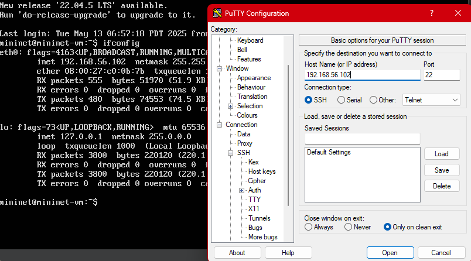
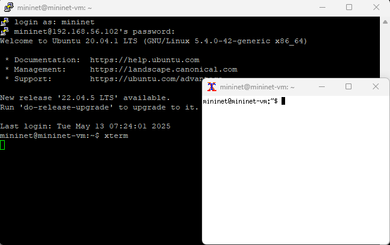
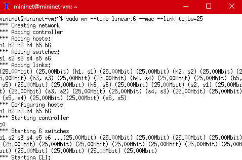
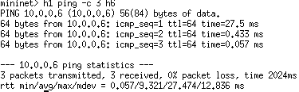
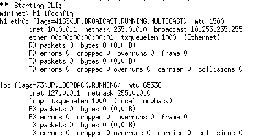
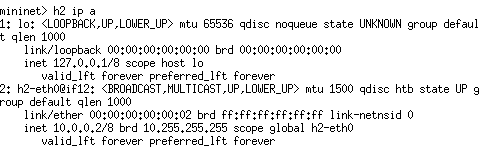
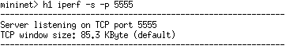
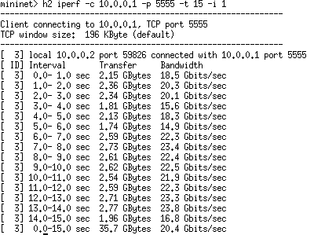

#  Simulação com Mininet: Topologia Linear com 6 Switches

##  Objetivo

Implementar, inspecionar e testar uma topologia linear no Mininet utilizando 6 switches, com configurações específicas e verificação de desempenho por comandos no terminal.

---

##  Tecnologias e Ferramentas

-  Mininet VM 
-  PuTTY 
-  Xming 

---

##  Etapas Executadas

### 1.  Configuração do PuTTY com X11 Forwarding

- Ativação da opção:  
  `Connection > SSH > X11 > Enable X11 forwarding`
  
- Configuração com IP `192.168.56.102` da VM Mininet

>  Print da configuração:  
>  

---

### 2.  Abertura do Xming no Windows

>  Xming rodando:  
> 

---

### 3.  Conexão via SSH com Mininet

> Conexão da VM Mininet:  
> 

> Teste de ping
> 

> Inspecionando h1
> 

> Inspecionando h2
> 

> Especificando h1 como servidor TCP
> 

> Especificando h2 como cliente e emitindo relatório
> 

---

